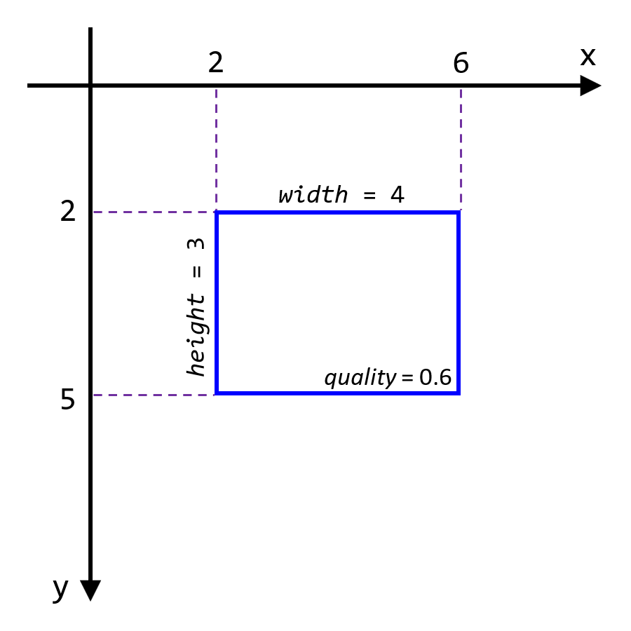

# Box Corp. Box Choosing Algorithm
## Our Objective
We here at Box Corp. are very concerned with boxes (rectangles). People often send us files full of box specifications, and we are responsible for chosing the best boxes from each file. In order to get only the finest boxes we:
1. remove any poor quality boxes based on a formula;
2. look for overlapping boxes and choose the best one based on a formula.

## How do we choose the best boxes? 
Boxes come in CSV files. [Here's](./src/BoxChooser/boxes.csv) the one you'll be working with. There may be a large number of boxes in the file. A file has 5 columns and a single-row header record. Each subsequent row describes a box. The rows (boxes) are not sorted. The columns are:
* two positive integer coordinates (`x` and `y`), representing the lower x and y bounds of the box;
* two positive integer dimensions (`width` and `height`), representing the size of the box; and,
* one decimal value (`quality`), between 0 and 1 inclusive.

Quality is a representation of how important the box is to us. A larger quality value will mean the box is more important (e.g., a box with quality = 0.8 is more important than a box with quality = 0.4). When forced to choose, we want to retain higher quality boxes.

An example of a box file with a single box would look like this:
| x | y | width | height | quality |
|----|----|----|----|----|
| 2 | 2 | 4 | 3 | 0.6 |

This would give a box that looks like this:

When we receive a box file, we want to *discard* any low quality boxes. Boxes with `quality < 0.5` should be discarded.

Next, we need to check whether any of the boxes significantly overlap other boxes. When two boxes significantly overlap each other, we want to retain the higher-quality box. The eliminated box is said to be *suppressed*. Two boxes are determined to significantly overlap if their intersection over union (IoU) is `≥ 0.4`. The formula for calculating IoU is: `IoU = <intersecting area of the boxes> / <union area of the boxes>`

It's important to note that the order in which you suppress boxes will affect which boxes are suppressed (see the below example). You need to process the file such that the highest quality boxes are retained and you need to avoid suppressing boxes unnecessarily.

As an example of the overall process, if we received a file with the below data, we would expect each box to be treated as shown.
* Box E (purple) is discarded as it's quality is too low.
* Box B (green) is suppressed because it significantly overlaps Box C (blue) and has lower quality than Box C.
* Box A (red) is retained because the only box it significantly overlaps is Box B (green), and Box B has already been eliminated by Box C (blue).
* Box C (blue) is retained, because the only box it significantly overlaps is Box B (green), and it has a higher quality than Box B.
* Box D (yellow) is retained, because it doesn't overlap any other box.

## What outcome do we want?
We want a CSV file containing the list of all retained boxes (all boxes neither discareded nor suppressed). We also want a print out of the number of boxes retained, discarded (due to low quality), and suppressed (due to overlapping significantly).

## What do we want you to do?
A solution exists in [the src directory](./src). This solution contains a sample [box file](./src/BoxChooser/boxes.csv). Write a program to satisfy the requirements above. Feel free to replace any/all existing code. You will be judged based on:
1. Accuracy: your algorithm needs to choose the correct boxes.
2. Code Quality: your code needs to be clean and maintainable.
3. Performance: your code needs to be efficient/fast.

There are `10,000` boxes in the file. `2510` boxes will be retained, `5026` boxes will be discarded, and `2464` boxes will be suppressed. The solution should take less than `1 second` to run.
